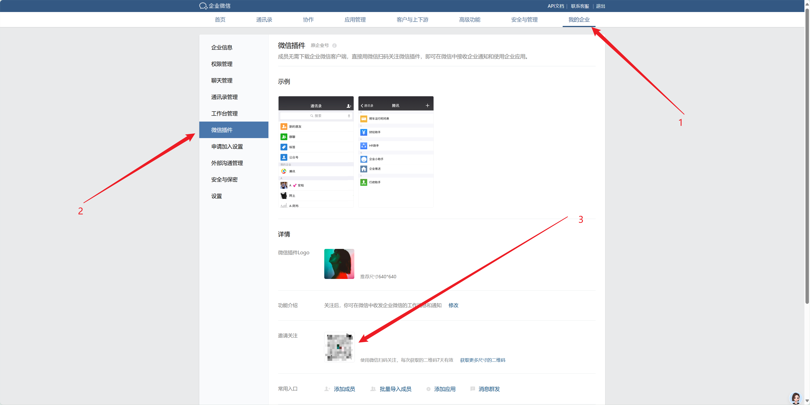

# 数据库查询数据导出为Excel并发送至微信

## 原由

被领导安排每天在数据库导出数据给用户，国庆节假期也要导数据发到微信群... 可是我要出去玩啊啊啊~~~~

于是就想，每天执行同样的sql，查询，导出，发送到微信群，这个草操作为什么不可以用程序实现呢？于是就有了这个项目。


## 准备工作

### 添加企微机器人

企业微信群，点击【添加机器人】-【创建一个机器人】-【填写机器人名称】-添加号机器人复制key，并配置在config-RoBot_key

### 让微信也能查看企微群消息

登录企业微信后台后，点击我的企业-微信插件，扫描二维码。这样就可以在微信里查看企业微信的群消息啦！


## 配置

打开config.ini文件

填写企微机器人key

```ini
[weixin]
RoBot_key = your_key
```

填写数据库信息

```ini
[database]
host = your_host
port = 3306
user = your_user
password = your_password
database = your_database 
```

填写任务配置

```ini
;任务配置
[task]
;name 为导出excel文件名称
name = test

;执行 sql 数据库名称
db = cloud2.0
;sql 查询语句路径
sql = ./sql/任务1.sql

;导出excel文件路径
export_data = ./output/test.xlsx
```

## 使用

请将 example-config.ini 重命名为 config.ini 并配置好。

运行：

```shell
python run.py
```

## 常见问题

### '%' (0x25) at index 232`

错误：`ValueError: unsupported format character '%' (0x25) at index 232`

处理：sql中包含% 号，需要转义，在% 前加一个% 即可。